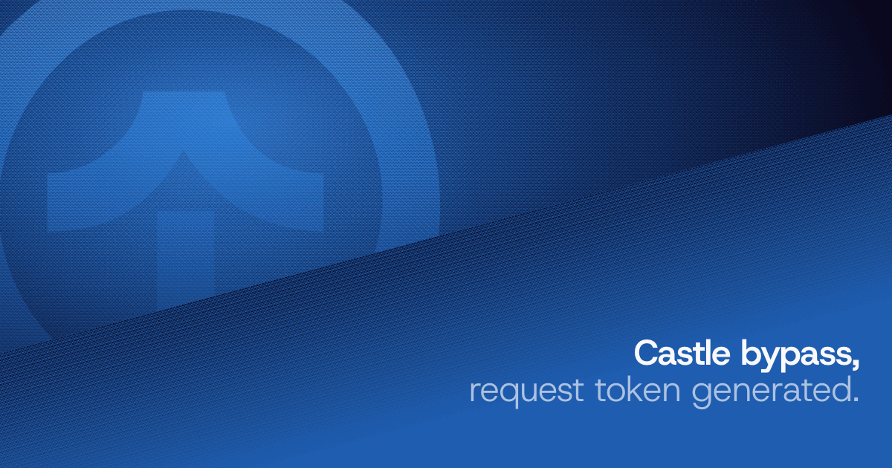

# Rockstar Games Castle Bypass (Login & Registration)
<div align="center">
  
  
  
  
  <a href="https://github.com/aster-go/rockstargames-castle-bypass"></a>
  <br />
</div>


<div align="center">
  <a href="https://takionapi.tech/"></a>
  <br />
</div>

Login and register accounts on `signin.rockstargames.com`, bypass **Castle** and **reCAPTCHA v3 Enterprise**. Antibots part is handled by [TakionAPI](https://takionapi.tech).

Get ready making your accounts for GTA VI.

## Table of Contents
- [Quick Start](#quick-start)
- [Important Notes](#important-notes)
- [How to Bypass Castle](#how-to-bypass-castle)
  - [The Castle Request Token](#the-castle-request-token)
  - [TLS Fingerprint Matching](#tls-fingerprint-matching)
  - [Session Fingerprinting](#session-fingerprinting)
  - [IP and Proxy Management](#ip-and-proxy-management)
  - [reCAPTCHA v3 Enterprise](#recaptcha-v3-enterprise)
- [Interacting with Rockstar](#interacting-with-rockstar)
  - [Headers](#headers)
  - [Login Flow](#login-flow)
  - [Registration Flow](#registration-flow)
  - [The Geo Trap](#the-geo-trap)
  - [Two-Factor Auth](#two-factor-auth)
- [TakionAPI Solution](#takionapi-solution)
  - [Getting an API Key](#getting-an-api-key)
  - [Generating Castle Tokens](#generating-castle-tokens)
  - [TLS Endpoint](#tls-endpoint)
- [FAQ](#faq)
- [Connect with me](#connect-with-me)

## Quick Start

Create an free account on [TakionAPI Dashboard](https://takionapi.tech/trial) in order to start your trial and get your `TAKION_API_KEY`

```bash
git clone https://github.com/aster-go/rockstar-castle-bypass.git
cd rockstar-castle-bypass
pip install -r requirements.txt
```

Copy `.env.example` to `.env`, fill it in, drop your proxies into `proxies.txt` (one per line, `ip:port` or `ip:port:user:pass`), and run:

```bash
python rockstar_login.py
```

For a full sign-up (age check, reCAPTCHA, registration, email OTP), run:

```bash
python rockstar_register.py
```

Both scripts handle 2FA natively (see [Two-Factor Auth](#two-factor-auth)): `rockstar_login.py` finishes the authenticator flow when the account has 2FA, `rockstar_register.py` enrols an authenticator on the account it just created and saves the secret.

Every script reads its account from `.env`, or you can pass it on the command line and skip the env entirely:

```bash
python rockstar_login.py --mail you@mail.com --password 'yourpass'                     # plain account
python rockstar_login.py --mail you@mail.com --password 'yourpass' --secret BASE32SECRET  # 2FA account
python rockstar_register.py --mail you@mail.com --password 'yourpass' --nickname coolname
```

## Important Notes

Every script shares one client, [`takion_castle.py`](./takion_castle.py). It keeps the `__cuid` cookie, the cookie jar, the TLS fingerprint and the proxy pinned together for the whole session. This matters more than it looks: Castle scores the **session**, not the single request. Mix those up, generate a token on one proxy and fire it from another, swap the User-Agent halfway through, and you're flagged before Rockstar even reads your credentials.

I keep this repo up to date with any changes to the sign-in flow. Always refer to it for a working example.

## How to Bypass Castle

This part is general. It's about **Castle** on any site that uses it, not just Rockstar. If you're on a different Castle target the same ideas carry over, only the endpoints and the body change.

### The Castle Request Token

The whole thing hinges on one header, `x-castle-request-token`. It's an encrypted bundle of device and session signals that Castle scores server-side. You can't hand-craft it, it comes from the SDK running against a real, consistent session. And it's married to the `__cuid` cookie: generate the token without carrying the matching `__cuid` and Castle reads the two as two different devices. Give it credit, the session model is simple but effective.

### TLS Fingerprint Matching

Castle checks the **TLS fingerprint** of the connection. The site expects a real Chrome hello, so your client hello has to match the Chrome your `User-Agent` claims to be. Send a shiny Chrome 150 UA over a plain Python `requests` stack and the JA3/JA4 won't line up, and you're scored before the form is even submitted. Obv Python's TLS won't fake a real Chrome on its own.

This example pins `client_hello="chrome150"` and lets TakionAPI's TLS layer produce the matching fingerprint. Want to check yours? Hit `https://tls.peet.ws/api/all` through the same client:

```python
response = solver.get("https://tls.peet.ws/api/all").json()
print(f"JA4: {response['tls']['ja4']}")
print(f"JA3: {response['tls']['ja3_hash']}")
```

### Session Fingerprinting

Castle doesn't grade one request in isolation, it builds a profile over the session:

- **Device consistency**, the same TLS, UA and `__cuid` on every request
- **Token freshness**, a token generated for this session and this proxy, not a recycled one
- **Header ordering**, headers in the exact order the browser sends them
- **Cookie continuity**, the edge cookies you pick up on the first page load have to travel with the rest of the flow

Change the UA mid-session or reorder the headers and it's flagged instantly. Consistency is the whole game.

### IP and Proxy Management

Castle is strict on IP reputation. Once an IP is dirty you get a `1.500.x` refusal (`errorCode` starting with `1.500`), which is a Castle block, not a credentials error. Two different problems, don't confuse them. So:

- **Different proxy per session**, never reuse a burnt IP
- **Generation lock**, the proxy you generate the token on is the proxy you send the request from
- **Residential or mobile**, not datacenter

The examples read `1.500.x` and tell you to rotate. Retrying on the same proxy just hands you the same refusal, so don't bother.

### reCAPTCHA v3 Enterprise

On top of Castle the forms carry **reCAPTCHA v3 Enterprise** (`x-captchatoken-recaptchaenterprise`). Login uses the `SignIn` action, sign-up uses `SignUp`. Both examples solve it through the Takion mirror (`/extra/recaptcha/create` then `/extra/recaptcha/pull`), so the only credential you need is your Takion API key, no separate captcha service. Quick and easy, each solve bills 3 requests.

The fun part is the sign-up email OTP. The code Rockstar emails you is **not** posted back to Rockstar. It goes through Google reCAPTCHA's own account-MFA endpoints (`accountchallenge` then `accountverify`), and only the verified token gets submitted to Rockstar to actually create the account. Took a capture to spot it, it's all in [`rockstar_register.py`](./rockstar_register.py).

## Interacting with Rockstar

### Headers

The sign-in XHRs share one header set. Two headers do the real work:

```json
{
    "x-castle-request-token": "<from Castle generation>",
    "x-captchatoken-recaptchaenterprise": "<from reCAPTCHA>",
    "rockstar-clientid": "rsg",
    "x-lang": "en-US",
    "x-requested-with": "XMLHttpRequest"
}
```

Order matters. Castle reads header order as part of the fingerprint, so keep it exactly as the examples send it. Don't sort it, don't move `x-castle-request-token`. This is also why `user-agent` and `sec-ch-ua` live inline in every header block instead of some constant at the top of the file, the browser identity belongs right there in the headers you're reading.

### Login Flow

Login is three moves on one session:

```
TLS session -> detect geo -> Castle token -> reCAPTCHA (SignIn) -> POST /api/login/rsg
```

A `200` is a real login. A `400` with `errorCode` `0.200.0` is a genuine wrong-password answer, which means the bypass worked and the account just didn't match. A `400` with `1.500.x` is Castle refusing the session, rotate the proxy. See [`rockstar_login.py`](./rockstar_login.py).

### Registration Flow

Sign-up is stricter and a lot longer:

```
detect geo -> warmup page -> age check -> reCAPTCHA (SignUp) -> POST /api/registration/rsg
   -> reCAPTCHA account MFA (accountchallenge -> accountverify) -> POST /api/registration/emailMfa/rsg
```

Reaching the `mfaToken` in the registration response means the account exists but is unconfirmed. Rockstar emails a 6-digit code, you verify it through reCAPTCHA, and the verified token goes to `emailMfa`, which answers `201` with the created account. The hard part is done at that point.

### The Geo Trap

Here's the one that'll waste your afternoon if you miss it. Login is not geo-checked. **Sign-up is.** Rockstar cross-checks three things and they all have to tell the same story:

1. the proxy exit IP country
2. the `country` field in the body
3. the Castle token's timezone and locale

The generator is geo-configurable, pass `country` and `timezone` and the token is pinned to that. The catch: big countries (US, CA, AU, RU, BR) span several timezones, so anything hardcoded mismatches any IP that isn't near the capital. So don't hardcode it. The examples read the real country and timezone off the proxy first with `solver.detect_geo()` (a quick `ipwho.is` lookup through the proxy) and drive the whole flow off that, the `country` field in the body, the token timezone and the exit IP all come from one source and can't drift apart. Get any of the three out of sync by hand and you earn a clean `1.500.7`.

```python
solver = TakionCastle("TAKION_API_XXX", "ip:port:user:pass", client_hello="chrome150")
country, timezone = solver.detect_geo()   # e.g. ("US", "America/Los_Angeles")
token = solver.generate_token("rockstar", country=country, timezone=timezone)
```

And some countries are refused outright no matter what you send. GB has been a systematic `1.500.7` even with a correct GB token and a UK proxy, that's a Rockstar-side restriction and not a token problem, so don't burn hours chasing it :P IT and US pass cleanly.

### Two-Factor Auth

Rockstar's 2FA is a TOTP authenticator (Google Authenticator, `deviceType: GoogleAuthenticator`). Two flows here, both folded into the base scripts: login into a 2FA account, and enrolling one.

**Logging into a 2FA account** (built into [`rockstar_login.py`](./rockstar_login.py)). Pass the TOTP `--secret` (or set `ROCKSTAR_2FA_SECRET`). The password login answers `200` but with `useMfa: true` and an `mfaToken` instead of signing you in. From there it's four more calls on the same session, each carrying its own Castle token:

```
login/rsg -> {useMfa, mfaToken} -> mfaDevices/rsg -> mfaSendCode/rsg -> (TOTP) -> mfaLogin/rsg -> signed in
```

`mfaSendCode` doesn't actually send anything for an authenticator, it just hands back a refreshed `mfaToken` that the final `mfaLogin` has to use. The code itself is a plain TOTP off the secret you saved at enrolment:

```python
import pyotp
mfa_code = pyotp.TOTP(secret).now()
```

**Enrolling an authenticator** (built into [`rockstar_register.py`](./rockstar_register.py), right after the account is created). This part runs on the Social Club API (`scapi.rockstargames.com`), which is Bearer authenticated, not Castle. So the session walks a short bridge to mint the token:

```
login -> connect/authorize/rsg -> connect/check/rsg (returns a code)
      -> gateway?code=... (sets the BearerToken cookie)
      -> scapi requestRegisterMfa -> {secretKey} -> (TOTP) -> scapi verifyMfaRegistration -> {status:true}
```

`requestRegisterMfa` hands back the base32 `secretKey`, the script confirms it with a live TOTP off that same secret, then appends `{email, password, nickname, totp_secret, rockstar_id, created_at}` to `accounts_2fa.json` (and prints it), so the secret you'll log in with later is never only in your head. The registration succeeds on its own, the enrolment is a follow-on step, so a blocked enrolment still leaves you a created account.

> One detail worth knowing: the `BearerToken` is delivered as a cookie on the gateway's `302`, so the gateway hop is fetched with `allow_redirects=False` to read that `Set-Cookie` off the redirect instead of following it. And `requestRegisterMfa` is a bodyless POST that the origin only accepts with an explicit `Content-Length: 0`, without it you get a `411`.

## TakionAPI Solution



Unless you want to start deobfuscating Castle, understanding it, and, the annoying part, keeping it up to date every time it changes, we at [TakionAPI](https://takionapi.tech) already do that for you. Same for the TLS client, which goes stale the moment Chrome ships a new hello. You focus on your business logic, we handle the bypass.

[`takion_castle.py`](./takion_castle.py) is the whole client, ready to drop in.

- [TakionAPI Docs](https://docs.takionapi.tech)
- [TakionAPI Trial](https://dashboard.takionapi.tech)
- [TakionAPI Discord](https://takionapi.tech/discord) for custom development and support.

### Getting an API Key

Start with a free trial at [takionapi.tech](https://takionapi.tech/demo) to get a key with some tokens in it. Nothing more than an email required, run your tests and reach out for anything.

### Generating Castle Tokens

```bash
curl -X GET 'https://castle.takionapi.tech/generate?website=rockstar&api_key=TAKION_API_XXX'
```

For a geo-pinned token (the one sign-up needs):

```bash
curl -X GET 'https://castle.takionapi.tech/generate?website=rockstar&country=IT&timezone=Europe/Rome&api_key=TAKION_API_XXX'
```

Or with the included client:

```python
from takion_castle import TakionCastle

solver = TakionCastle("TAKION_API_XXX", "ip:port:user:pass", client_hello="chrome150")

# Login token
token = solver.generate_token("rockstar")

# Sign-up token, geo-pinned to the proxy
token = solver.generate_token("rockstar", country="IT", timezone="Europe/Rome")
```

### TLS Endpoint

The same client sends TLS-matched requests through Castle's TLS layer, so the fingerprint stays correct and the cookie jar rides along automatically:

```python
response = solver.get(
    "https://signin.rockstargames.com/create/?cid=rsg&returnUrl=%2F",
    headers={...},
)
print(response.status_code, response.text[:100])
```

That's it. Now go build the actual thing.

## FAQ

> I keep getting `1.500.x`, what's wrong?

That's Castle refusing the session, not a bad password. The IP is flagged. Rotate to a clean proxy and make sure the token was generated on the same proxy you send from.

> Login works but sign-up always returns `1.500.7`.

Read [The Geo Trap](#the-geo-trap). Proxy country, `country` field and token timezone all have to match, and a few countries (GB) are just refused. Try IT or US.

> Can I use another Python TLS library?

Only if it produces the exact JA4/JA3 a real Chrome does, and most are too outdated for that. Use TakionAPI's TLS endpoint if you want to be sure.

> The email OTP keeps getting rejected.

The reCAPTCHA challenge expires after a few minutes, so enter the code promptly. And remember it goes through reCAPTCHA (`accountverify`), not straight to Rockstar.

> How do I log into a 2FA account?

`python rockstar_login.py` with the TOTP `secret` (from `.env` as `ROCKSTAR_2FA_SECRET`, or `--secret` on the CLI). `rockstar_login.py` handles both, a plain account signs in on the first call, a 2FA account runs the full `login -> mfaDevices -> mfaSendCode -> mfaLogin` flow. Fully working.

> Registration failed at the 2FA enrolment step, but the account was made.

The account creation and the enrolment are separate, a created account is never lost to an enrolment error. Enrolment runs on the Social Club API with a Bearer minted through the connect bridge. If it trips, check the two gotchas in the [Two-Factor Auth](#two-factor-auth) note: the gateway hop must not follow its `302` (that is where the Bearer cookie lives), and `requestRegisterMfa` needs an explicit `Content-Length: 0`.

> I'm on a different Castle-protected site, do you support it?

Change the `website` parameter and you're most of the way there. Not sure about your target's flow? Hit me on Discord.
